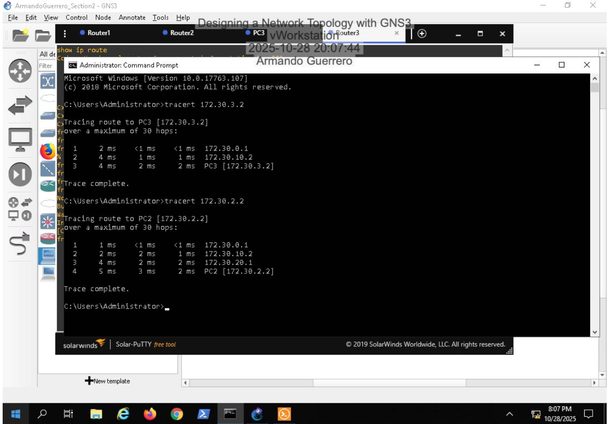

# Enterprise Network Topology Design & Implementation (GNS3)

## Overview
Designed and implemented both Layer 2 and Layer 3 network topologies using GNS3 to simulate an enterprise network environment. The project focused on switching fundamentals, routing validation, and remote device management.

---

## Environment
- GNS3 network simulation
- Virtual routers and switches
- Windows/Linux virtual hosts

---

## Key Implementations

### Layer 2 Configuration
- Configured host IP addressing
- Established logical connectivity through switch bridge settings
- Validated ARP broadcast behavior
- Captured ARP traffic for analysis

### Layer 3 Configuration
- Examined router routing tables
- Performed traceroute testing to validate path selection
- Verified end-to-end connectivity across network segments

### Switch & Remote Management
- Managed switch ports within topology
- Configured Open vSwitch bridge
- Assigned IP address to managed switch
- Established SSH remote access
- Verified connectivity using ping and tracert

---

## Skills Demonstrated
- Routing fundamentals
- Switching and ARP analysis
- CLI troubleshooting
- Network validation testing
- Remote device management (SSH)

---

---

## Screenshots

### Layer 2 Topology

### Layer 3 Topology

### ARP Broadcast Capture

### Traceroute Validation

### SSH Remote Access

